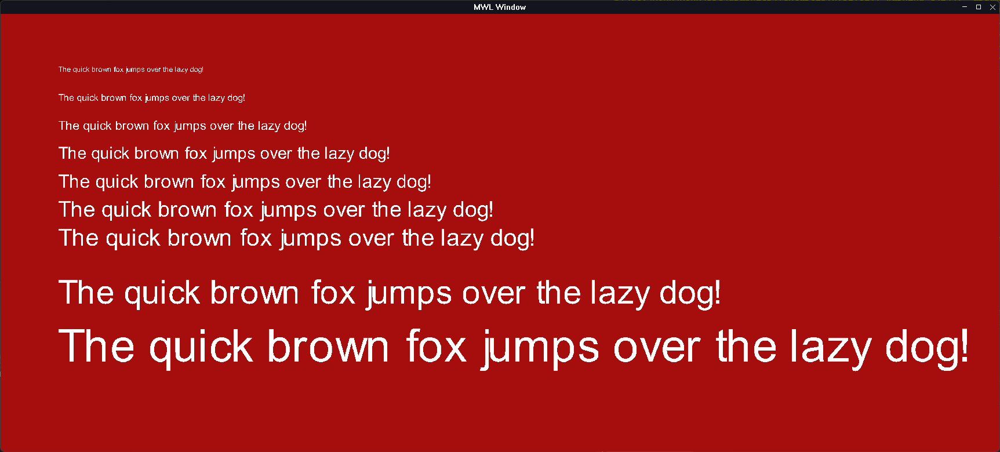

```
Creating font atlas from .ttf file
```

# MFL (Monk Font Library)

## Building
To build the library run premake5 for your correspoing build platform

Example:
> premake5 vs2022

## Demos

Example font atlas


Example text rendering
