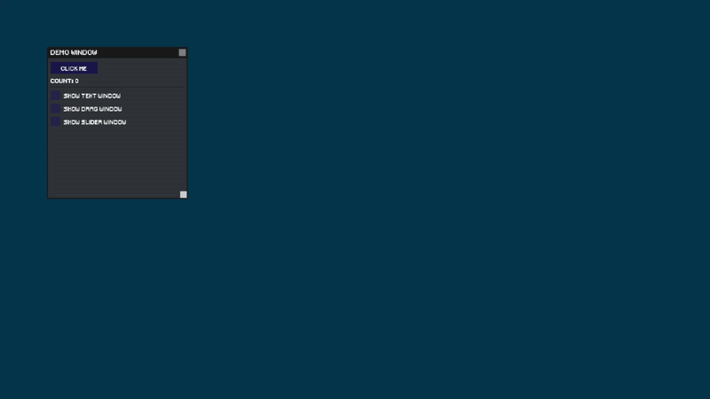
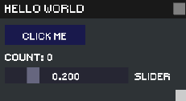

```
Immediate mode GUI 
```

# MUI



Allows you to create simple graphics UI. Including
* Text
* Buttons
* Checkboxes
* Radioboxes
* Sliders
* Drags
* Separators

## Usage example
```
mui::Begin("Hello world");

if(mui::Button("Click me"))
    count++;
mui::Text("Count: " + std::to_string(count));
mui::SliderFloat("Slider", &value, 0.1f, 0.0f, 1.0f);
mui::End();
```



## Building
To build the library run premake5 for your correspoing build platform

Example:
> premake5 vs2022